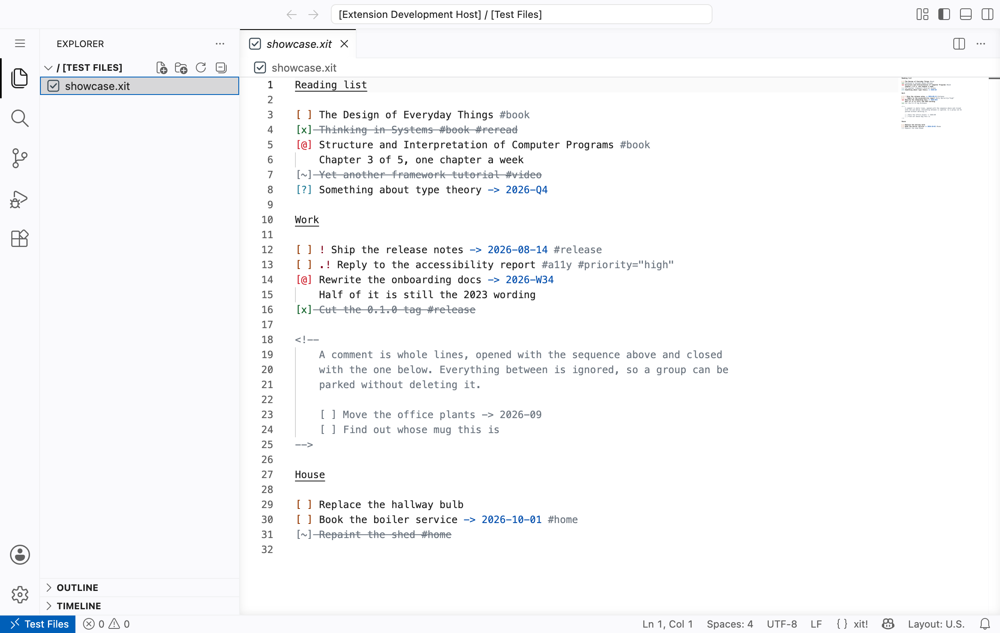

# xit!

Language support for [[x]it!](https://xit.jotaen.net/) plain-text todo lists.

**This is a personal fork of the format, not an implementation of it.** It starts from the [x]it! specification v1.1 and changes ten things on purpose — marked titles, a sixth checkbox status, start dates, subtasks, comments, priority without dot padding, one tab per nesting level, references between items, file-level directives, and a much wider tag syntax. Each is listed with its reasoning under [Divergences from upstream, on purpose](#divergences-from-upstream-on-purpose), and a conformance suite runs every example from the format author's own syntax guide on each commit so the divergences stay deliberate.

Files written for it still open anywhere. Files written for the official format may not read correctly here — `- [ ] like this` is an error rather than a heading, and that is the point.

**The format**  
[Titles](#titles) · [Subtasks](#subtasks) · [Waiting](#waiting) · [Priority](#priority) · [Start Dates](#start-dates) · [Overdue Dates](#overdue-dates) · [Tag Values](#tag-values) · [Comments](#comments) · [Blank Lines Inside an Item](#blank-lines-inside-an-item) · [Links](#links) · [One Item Waiting on Another](#one-item-waiting-on-another) · [Time Estimates](#time-estimates) · [Completion Dates and Repeats](#completion-dates-and-repeats) · [What a File Says About Itself](#what-a-file-says-about-itself) · [In Markdown](#in-markdown)

**Using it**  
[Syntax Highlighting](#syntax-highlighting) · [Workspace Items](#workspace-items) · [Filtering by Tag](#filtering-by-tag) · [Status Bar](#status-bar) · [Pointing at a Checkbox](#pointing-at-a-checkbox) · [Raw and Parsed](#raw-and-parsed) · [Outline and Folding](#outline-and-folding) · [Sorting a Group](#sorting-a-group) · [Archiving Finished Items](#archiving-finished-items) · [Postponing](#postponing) · [Tag Completion](#tag-completion) · [Editing Something Inside a Comment](#editing-something-inside-a-comment) · [Problems](#problems) · [Migrating an Older File](#migrating-an-older-file)

**Reference**  
[Development](#development) · [Installing your own build](#installing-your-own-build) · [Lint and formatting](#lint-and-formatting) · [The two integration runs](#the-two-integration-runs) · [Shortcuts](#shortcuts) · [Snippets](#snippets)

## Titles

A title is marked with `#` and a space.

```
# Groceries
[ ] Milk
[ ] Bread
```

The specification defines a title by what it is *not* — it "MUST NOT start with a blank character or the opening square bracket character `[`", and that is the whole rule. So the format has no invalid state for a line: anything that fails to be an item is silently promoted to a heading. These all became titles:

```
- [ ] Buy milk
* [ ] Call Sam
x] Slip
```

The first two are what anyone with Markdown habits types. None of them appeared in the workspace view, and none of them looked wrong — a heading in the Outline looks exactly like a heading you meant. The failure is not a mis-rendered line, it is a lost task.

With a marker, a line is a title, an item, a continuation, a comment, or an error you can see. Anything else is highlighted as `markup.other.task.invalid.xit` and reported as `unrecognised-line`.

The space after the `#` is what keeps a title clear of a tag: a tag needs a name character straight after the hash, so `# Groceries` can never be one, and `#groceries` alone on a line is an error rather than a heading that happens to look like a tag. A bare `#` is a legal title with no name, because the specification already lets a group be headed by nothing in particular.

**This is a fork of the format,** and it costs four entries in the conformance allowlist — the guide writes its four headline examples unmarked. It refunded two: both places where the guide called a line invalid and we called it a title, because the guide adds "A headline must be separated by a blank line from a preceding item" and the specification says no such thing. With a marker there is nothing left to argue about.

## Subtasks

An item indented under another is a subtask. **One tab per level.**

```
[ ] Ship the release
	[x] Write the notes
	[x] Tag the commit
	[ ] Publish
```

There is no depth limit, on purpose. A cap would have to live in the TypeScript and in the diagnostics and could not live in the grammar, which nests by back-referencing its parent's indentation and so cannot count; the highlighting and the diagnostics disagreeing about one line is worse than no limit at all.

Check the last outstanding subtask and the parent checks itself, all the way up the nest. Uncheck one and the parent reopens, because a ticked parent above an unticked child states something false. Turn it off with `xit.autoCheckParents`. It only ever moves an item between open and checked — an ongoing, obsolete or in-question parent was set deliberately and is left alone.

**Spaces do not nest.** This rule was looser to begin with — "two or more spaces, or one tab, from the previous level" — and that was our own invention and too loose to keep. A three-space line became a child of a two-space one, so a single stray space created a nesting level and nothing said anything. Tabs for indentation, spaces for alignment: nesting is structure and should scale to whatever depth you like a level to look, so it is a tab.

A space-indented checkbox is not lost by the change. Indentation only decides which item is the parent, so such a line becomes a sibling rather than a child, and the Problems panel reports it as `cannot-nest`. Four spaces or more stays silent, because that is a description continuation and a continuation may begin with a bracket.

Description continuations are unchanged: four spaces, or a tab. Four is not arbitrary — `[ ] ` is exactly four columns, so the continuation lands under the first letter of the description. A tab is however many columns the reader's tab stop says, which is four here and eight on GitHub and in most terminals, so spaces are what keep that alignment true everywhere. The tab is kept alongside them because otherwise the Tab key would nest a subtask and break a continuation. `.xit` files default to `editor.insertSpaces: false`, so Tab inserts a real tab.

Separating the two rules had an unexpected reward. The syntax guide's `description/8` says "Square brackets in the description (even at the beginning of subsequent lines) are not recognised as checkboxes", with a four-space example — and that example agrees with this grammar again, so tightening a rule for its own reasons gave a conformance divergence back.

A closed parent strikes through its own description, but not its subtasks: an open subtask under a checked parent is not done, and is not drawn as though it were. A subtask struck through is one that is closed in its own right.

**This is a fork of the format.** [Discussion #2](https://github.com/jotaen/xit/discussions/2) is the most-upvoted open request on [x]it!, at 21, and jotaen has not adopted it — his stated hesitation is whether editors can implement it at all. Other xit tools will read a subtask as the parent's description text, which still reads correctly to a person, but the nesting is ours alone.

The one thing it costs: a description continuation indented with a tab can no longer begin with a literal `[ ]`, because that is a subtask. At four spaces it can, which is why the guide's own example of exactly that agrees with this grammar.

**A four-space `[ ]` is description everywhere, not just in the highlighting.** It is not an item, so it does not appear in the workspace view, does not count towards its parent's auto-check, and is not moved by sorting or archiving. That was not always true — the tooling read it as a task while the grammar read it as prose, so it turned up in the sidebar as work you had never written.

## Waiting

`[>]` means the item should happen, you cannot act on it, and someone or something else holds it.

```
[>] Waiting on the contract to come back
[@] Writing the release notes
[ ] Publish
```

None of the five statuses in the specification covers this. `[@]` ongoing means you are doing it, and `[?]` in question means it is unclear the thing should happen at all. Status is the primary axis of the format — it is why the checkbox is the leftmost thing on the line — and waiting gates what you can do, which is what a status is for. A tag would describe it; only a status gates it.

A waiting item is outstanding: it is not finished, so it appears in the workspace view and the shuffle cycle passes through it. Toggling one checks it, on the grounds that what you do to a waiting item when it stops waiting is finish it.

`>` was chosen rather than any other character, and the choice is measured rather than aesthetic. The syntax guide names the characters it considers invalid — `[*]`, `[o]`, `[X]`, and `[ ]` with a non-breaking space — and `>` is not among them, so no example in the conformance corpus changes meaning and the divergence costs nothing. `*` or `o` would each have flipped one example from invalid to valid. It also collides with nothing: priority uses `!` and `.`, and the due-date arrow is unambiguous inside brackets.

**This is a fork of the format.** Other [x]it! tools read `[>] Waiting` as neither an item nor a title, so the line disappears from their lists rather than rendering oddly. That is a worse failure than the other forks here cost, and it is accepted deliberately — see [emrikol/xit](https://github.com/emrikol/xit).

## Priority

Priority is exclamation marks. `[ ] !!! Ship it` is more urgent than `[ ] ! Ship it`.

**The dots are gone, and that is a fork.** The specification allows "any number of exclamation marks (`!`) and dots (`.`)" with the dots on one side only, and the syntax guide says what they are for: "The priority can be padded with dots on either side." They are alignment filler, so the marks line up in a column:

```
[ ] ...! Low
[ ] ..!! Medium
[ ] !!!! Urgent
```

That is visual presentation stored in the document, and it is not cheap: three of the guide's seven priority rules exist only to police the padding, and two of the divergences this fork already carried were arguments about it. Alignment is a rendering concern, and an editor can draw a column with a decoration without putting a character in the file.

**If you want the column back, `xit.alignPriorities` draws it** — off by default:

```
[ ] ..! Low        ← what the specification stores in the file
[ ]   ! Low        ← what this draws, with the file unchanged
```

Nothing is inserted. The padding is a decoration, so the text on disk is untouched and it vanishes with the setting. It aligns within each group *and each nesting level*: aligning across a file would let one urgent item indent everything below it, and aligning across levels achieves nothing at all, since a top-level item and a subtask have different base indents and their marks cannot line up however much padding is added.

Off by default on purpose: **Sort Group** answers "which of these is most urgent" definitively, and a column only helps you eyeball it. The dots existed because plain text had no alternative; the alternative turned out to be sorting rather than drawing. One honest cost — inline decoration content is not in the document, so the cursor steps over the gap rather than through it, the same way VS Code's own inlay hints behave.

One thing falls out for free. `[ ] !!. Do this` has no priority at all rather than a priority of `!!`, and no new rule was needed to say so — the guide already has "If the space between priority and description is missing, the exclamation mark is treated as part of the description", and with the dots gone a dot after the marks is exactly that missing space.

## Start Dates

`<- 2026-09-01` is the earliest day an item can be worked on.

```
[ ] Book the venue <- 2026-09-01 -> 2026-09-30
```

This is the one real gap in the format: `-> ` says when a thing is due, and nothing said when it could begin. It takes exactly the same date patterns — a day, month, week, quarter or year, with `-` or `/` — and reads them from the **first** day of the period, where a due date reads the **last**. `<- 2026-08` becomes actionable on 1 August; `-> 2026-08` stays on time until 31 August.

An arrow rather than a tag, because a start date and a due date are the same kind of thing: **syntax is for what you author, tags are for what the editor records.**

In the workspace view, an item whose start date has not arrived goes to **Not started yet**, below everything you can act on. It is not hidden — hiding it would lose work — and it is not ranked by a due date you cannot work towards yet. `[>]` waiting items get the same treatment in **Waiting on someone else**, because they are the same question with a different answer: work you cannot act on.

**Known cost:** `<-` and `<!--` both open with `<`. There is no ambiguity for the parser — a comment is line-initial and occupies whole lines, while `<-` lives inside a description — but the two are confusable to read. Every alternative arrow was worse, so this is accepted rather than solved.

The grammar and `src/dueDate.ts` build both arrows from one shared date pattern, and `test/dueDate.test.mjs` runs every due-date example in the conformance corpus through the start-date rule with the arrow swapped, so a corpus written for one tests the other.

## Overdue Dates

A due date whose period has passed is marked, and one more than a fortnight past is marked again in a second colour.

| Setting | Default | |
| --- | --- | --- |
| `xit.overdueDueDates` | `true` | Turn the marking off entirely. |
| `xit.overdueDueDateStyle` | `border-and-background` | `border-and-background`, `background`, `border` or `underline`. |
| `xit.criticallyOverdueAfterDays` | `14` | Days past the end of the period before the second colour. `0` uses one colour for everything. |

Six theme colours are contributed, so any of it can be recoloured: `xit.overdueDueDateBackground`, `xit.overdueDueDateForeground`, `xit.overdueDueDateBorder`, and the same three under `xit.criticallyOverdueDueDate…`.

A due date names a period, not always a day, so it counts as passed only once the whole period has ended:

| Written | Overdue from |
| --- | --- |
| `-> 2026-01-31` | 1 February 2026 |
| `-> 2026-01` | 1 February 2026 |
| `-> 2026-Q1` | 1 April 2026 |
| `-> 2026-W01` | 5 January 2026 |
| `-> 2026` | 1 January 2027 |

Weeks follow ISO 8601, so week 1 is the one containing the first Thursday of the year, and a week can end in the following year: `-> 2022-W52` runs out on 1 January 2023.

Only the first due date of an item counts, as the specification requires, and this applies to `.xit` files only — not to xit inside a Markdown fence.

### Why the filled styles set the text colour too

The two styles that paint a background also set the foreground, and they cannot be separated. A background the extension chooses, under text the theme chooses, is a pair of colours that have never met: the first version of this did exactly that, and in Monokai a purple `#AE81FF` date landed on the amber fill at 2.73:1, down from 5.23:1 with no marking at all. Lowering the opacity did not rescue it, and three bundled themes are already below 4.5:1 before anything is drawn, so no fixed threshold was even reachable.

Owning both sides fixes it by construction — the same pair in every theme, including ones written after this, at 9.36:1 on dark and 5.54:1 on light. The `border` and `underline` styles own neither side, which is equally safe: the text keeps exactly the contrast the theme gave it.

The critical tier is bold as well as red. Amber and red are chosen to weigh the same so they read as one family, which leaves hue as the only thing between them, and amber against red is the pair red-green colour blindness collapses. WCAG SC 1.4.1 asks that colour not be the only cue, so weight is the one that carries.

`test/contrast.test.mjs` computes all of this against the seventeen themes VS Code ships, on every commit.

## Tag Values

An unquoted tag value runs to whitespace, minus trailing punctuation.

```
[ ] Water the plants #repeat=+7d
[ ] Write the report #est=1.5h
[ ] Post it #after=linked.xit#k3f9
[ ] Ship it #branch=feature/login-v2, then tell the team
```

The last one gives `feature/login-v2` — the comma is trimmed, because a value should be able to end a clause.

**This is a fork,** and it replaced two bugs rather than one feature. Spec §Tag allows only letters, digits, `_` and `-` unquoted, which meant `#repeat=+7d` parsed as `#repeat=` with **no value at all** and `#est=1.5h` parsed as `#est=1`. Both silently. The decimal estimate this README documented had never once worked. Widening the set a character at a time was the wrong shape of fix, so the rule changed instead.

Trailing `.` `,` `;` `:` `!` `?` `)` `]` `}` and quotes are trimmed. A leading quote is excluded, so `#tag="unterminated` still falls to the specification's rule that an unclosed value is disregarded.

**Tag names take letters, marks, numerals, emoji and `_` `-`.** That is wider than the specification, which allows letters, digits, `_` and `-` — and widening it fixed a bug rather than adding a nicety:

```
#हिन्दी   →  #ह          before
#हिन्दी   →  #हिन्दी      now
```

Devanagari vowel signs are combining *marks*, not letters, so the specification's set breaks Devanagari, Thai, Arabic diacritics, and `#❤️` — whose variation selector is also a mark. The conformance corpus tests UTF-8 with Greek, Latin and CJK, none of which use combining marks, which is exactly why the suite written to catch encoding bugs never caught this one. Once marks are in, excluding emoji is an arbitrary line, so `#tag🥳` and `#👨‍👩‍👧` work too.

Emoji specifically, not all symbols. `=`, `+`, `<` and `>` are Unicode *math symbols*, and a name that swallowed `=` would turn every `#tag=value` into one long name.

A `.` is allowed inside a name but never at the end, so `#v1.2` is one tag and `[ ] This is a #tag.` still ends at the tag — the same trailing trim a value gets, for the same reason.

**Punctuation still stops a name, and deliberately so.** The syntax guide pins this in `tags/2`, and the examples are the argument:

```
[ ] This is a #tag.      → #tag
[ ] (#tag)               → #tag
[ ] Tags: #tag1/#tag2    → two tags
```

A name that took any printable character could never end a sentence. A value gets the same courtesy through the trailing trim; a name gets it by staying narrow.

## Comments

A comment occupies whole lines. It starts with `<!--` at the beginning of a line, and ends with `-->` followed by nothing but spaces. Both may be on the same line.

```
<!-- This list is on hold -->
[ ] An item

<!--
[ ] This item is commented out
[ ] So is this one
-->
```

A comment does not split a group, so the items on either side of it stay in one group. A comment cannot appear inside an item, between its description lines. An unterminated comment runs to the end of the file.

Comments are a fork of the [x]it! specification, not part of the official format, so other [x]it! tools will not understand them. See [emrikol/xit](https://github.com/emrikol/xit).

## Blank Lines Inside an Item

An item cannot contain a blank line. A blank line ends the group, so a description with two paragraphs of notes is not writable — and **this limit stands on purpose.**

The obvious fix is that a continuation line holding only its indentation counts as a blank line within the item. Two things are wrong with it. The syntax guide already considered and rejected it — `groups/2`: "An item cannot contain a blank line, even if the blank line is 'indented' (i.e., has 4 spaces)". And worse, it is invisible: `files.trimTrailingWhitespace`, `editor.trimAutoWhitespace` and every `.editorconfig` doing the same will delete it. A file that silently reformats when you save it is worse than the limit it removes.

There is already a workaround that needs no change to the format at all. Put a visible character on the continuation line:

```
[ ] Write the proposal ...
    The first paragraph of notes.
    .
    The second paragraph.
```

A lone `.`, `~` or `|` is ordinary description text, so the item stays whole, nothing is reported, and no whitespace stripper will touch it. That is a better answer than any marker the format could invent, because the format does not have to invent one.

## Links

A URL in a description is highlighted as one, and its fragment is not read as a tag.

```
[ ] Read https://example.com/docs/#installation
```

Without this, `#installation` was a tag. The format has no escaping at all and says so on purpose — the syntax guide's `tags/8`: "Backslashes don't have special meaning, i.e. escaping a quotation is not supported." Most links escape by luck, because a tag needs a space or punctuation before the hash and `docs#installation` has a letter there. A bare fragment after a slash does not.

The narrow fix rather than the general one. A backslash escape would be more powerful, would contradict a rule the format states, and would add a character you have to think about in every description. Consuming the whole link first fixes the case that actually happens and asks nobody to learn anything.

**`#FF8800` in a description is still a tag,** and that is accepted rather than overlooked. It follows a space, so it is a tag by the format's own rules; it is rare; and the alternative is inventing that escape character. If you need one, quote it in a tag value: `#colour="#FF8800"`.

## One Item Waiting on Another

The only thing the format genuinely could not express: items could not refer to each other.

```
[ ] Draft the contract #id=k3f9
[ ] Send it out #after=k3f9
```

**xit!: Give This Item an Id** puts an id on the item under the cursor and copies `#after=…` to the clipboard, because pasting a reference is the next thing anyone does. `#after=` is clickable and jumps to what it waits on.

An item waiting on something unfinished is **blocked**, and gets its own group in the workspace view — the same answer as a `[>]` waiting item and one whose start date has not arrived. All three are work you cannot act on: sorted below everything you can, and never hidden.

Four things get reported in the Problems panel: an id nothing has, an id used twice, a cycle, and waiting on something already finished. A cycle is an error because nothing in it can ever start; the rest are warnings, because the file still means something, it just does not mean what it looks like.

**Ids are generated, not derived.** An id has to survive a re-sort and a move between files, and both **Sort Group** and **Archive Finished Items** rewrite lines — either would break every reference in the file if an id were a line number or a hash of its surroundings. They are four characters of base32 with the vowels and the look-alike pairs removed, so an id cannot spell a word and can be read aloud.

**A reference can name another file.** Quote the value, because `.` and `#` are not legal in an unquoted tag value and a quoted one takes anything — so this needs no new syntax at all:

```
[ ] Post the contract #after="linked.xit#k3f9"
```

The `.xit` may be left off. The file resolves beside the one doing the referring, and the link is clickable across files because the workspace index has already read every `.xit`.

**Naming the file beats making ids unique across the workspace.** Nothing generates or enforces that uniqueness, so a global namespace works right up until two files collide and is then silently wrong. An explicit filename cannot be silently wrong.

One consequence worth knowing if you read the source. `collect()` is a pure function over one document, and it answers "is this blocked" for references within that file — which is the only answer a pure function can give, and the right one for a document read on its own. The workspace index follows the cross-file references afterwards and settles it. `src/link.ts` skips them deliberately for the same reason, and `extension.ts` is where a reference to a file that has no such id gets reported.

Nothing cascades. Checking an item does not check what waits on it, and nothing reorders itself — a dependency describes the world, it does not get to edit your file.

## Time Estimates

`#est=2h` on an item, and the workspace view totals each group beside its count.

Values are a number and a unit: `30m`, `2h`, `1.5h`, `1d`, `1w`. A day is eight hours and a week is five days — a convention rather than a fact, written down because it changes how totals read. `xit.estimateTag` names the tag.

A group with unestimated items in it shows `6h + 4`, not `6h`. A total that quietly leaves things out reads as "this group is six hours" when it is six hours plus however long four other things take, and a number that lies is worse than no number.

It has its own parser rather than sharing the repeat interval's, and they are not duplicates: `2m` is two minutes here and two months there. That difference is the reason, not an oversight — there is no drift detector between them because there is no shared rule to drift from.

A tag rather than an arrow, unlike the start date. The rule says syntax is for what you author, and an estimate *is* authored, so that alone would allow one. What decides it is cost: adding a single character to the status set touched eleven hand-written patterns across the grammar, the TypeScript and a test. An estimate is not a date and pairs with no existing arrow, so it buys none of that back.

## Completion Dates and Repeats

| Setting | Default | |
| --- | --- | --- |
| `xit.stampCompletionDate` | `false` | Record when an item was checked. |
| `xit.completionDateTag` | `done` | Name of that tag. |
| `xit.stampCreationDate` | `false` | Record when an item was written. |
| `xit.creationDateTag` | `created` | Name of that tag. |
| `xit.repeatItems` | `true` | Insert the next occurrence when a repeating item is checked. The tag is the opt-in, so this only affects items that have one. |
| `xit.repeatTag` | `repeat` | Name of the tag that marks a repeating item. |

Both use tags rather than new syntax, because **syntax is for what you author and tags are for what the editor records**. A completion date is not something you type to plan; it is something the tool writes down for you.

`xit.stampCompletionDate`, **off by default**, records when an item was checked and removes the record if it is reopened. `xit.completionDateTag` names the tag, default `done`. This is the format author's own suggestion, from [#59](https://github.com/jotaen/xit/discussions/59): `[ ] Paint the room #created=2023-02-01 #completed=2023-03-04`.

`xit.stampCreationDate`, also off by default, is the other half of that example. It records when an item was created, as you finish typing its checkbox, so an item with both tags records its own cycle time.

Its trigger is deliberately narrow, because a wrong date is worse than no date. It fires only on a single change that touched the checkbox itself, which means:

- **a pasted block is not stamped** — a paste is one change carrying several lines, and today is not when that work was created;
- **undo and redo do not stamp** — those are you putting the file back, not writing an item;
- typing in a description does not stamp, only finishing a checkbox does.

With both tags on an item, the workspace view shows **how long it took** — on the row when you toggle completed items into view, and in the tooltip. That is the report the two tags were always being recorded for.

A cycle time of zero reads as "same day", which is an answer rather than a gap. A negative one is shown as written, with a note that the dates disagree, rather than quietly clamped to zero — silent tidying is the thing this fork keeps removing.

Neither is git a substitute for these tags, and the reason is worth knowing. Sorting a group and archiving finished items both rewrite lines, so after either runs once `git blame` records when you *sorted*, not when you *wrote*. Once a format gains reordering, it has to carry its own dates.

An item tagged `#repeat=` is rescheduled when you check it — the checked one stays, and its next occurrence is inserted below:

```
[x] Water the plants -> 2026-08-03 #repeat=weekly
[ ] Water the plants -> 2026-08-10 #repeat=weekly
```

Intervals are `daily`, `weekly`, `monthly`, `quarterly`, `yearly`, `weekdays`, a named day such as `monday`, or a count such as `3d`, `2w`, `6m`. An item that also carries a start date has **both** dates moved, because a new occurrence is a new window — leaving the start date behind would give the next occurrence a date from the past, and the tag would silently stop meaning anything. The date keeps whichever pattern it was written in, so `-> 2026-01 #repeat=monthly` becomes `-> 2026-02`, a month rather than a day in February. An interval that is not recognised does nothing at all: scheduling something on a date nobody asked for is worse than not scheduling it.

`weekdays` skips Saturday and Sunday. A named day lands on the next day of that name, so a Monday item checked on the Wednesday reschedules to the following Monday rather than drifting a day further every time.

### Repeating from completion

A leading `+` counts from the day the item was checked rather than from its due date. This is the difference between rent and watering the plants:

| | |
| --- | --- |
| `#repeat=7d` | Seven days after it was **due**. Late payment does not move the next rent day. |
| `#repeat=+7d` | Seven days after you **checked it**. Water the plants three days late and the next watering is seven days from then, not four days away. |

**An unquoted tag value takes almost any character in this fork.** See [Tag Values](#tag-values) — this is one of the things that needed fixing for it to work at all.

## What a File Says About Itself

A comment can carry a directive, and it applies to the whole file.

```
<!-- xit: tags=work, client-acme -->
<!-- xit: archive=Done -->
```

| Key | What it does |
| --- | --- |
| `tags` | Every item in the file inherits these tags. A `work.xit` does not need `#work` on two hundred lines, and completion offers them like any other tag in the workspace. |
| `archive` | Names the group finished items are archived under, beating `xit.archiveTitle`. The setting is one answer for every file; this is the file's answer for itself. |

A comment is where this costs least. Comments are already a fork of the specification, so a file using them already reads wrong in other [x]it! tools and a directive inside one adds no new breakage. It also means the whole thing is invisible to the grammar, the outline and the diagnostics without any of them being taught about it — they already skip comments.

A known key that cannot use its value — `<!-- xit: tags=not a tag -->` — is reported as `unrecognised-value`, exactly like `#repeat=sometimes`. Same failure: you wrote it, the file kept it, nothing uses it.

**An unknown key is ignored, and reported only as a hint.** A directive written for a later version must not break an earlier one, and *warning* about it would make every new key a breaking change for anyone who has not updated. But a typo is indistinguishable from a future key, so complete silence leaves you no way to tell them apart — a hint is visible if you look and fails nothing. A tag name the format could not express is ignored for the opposite reason: a directive must not be able to declare something you could not have written by hand.

## In Markdown

A fenced code block tagged `xit` is highlighted inside any Markdown file.

````markdown
Notes from the meeting.

```xit
# Follow-ups
[ ] ! Write it up -> 2026-08-14 #work
[x] Book the room
```
````

This is the format author's own suggestion for keeping a list inside a larger document, from [discussion #10](https://github.com/jotaen/xit/discussions/10). Nothing about the fence is special to this extension: ` ``` ` and `~~~` both work, the language name is case-insensitive, and the block is ordinary Markdown everywhere else.

## Syntax Highlighting



### Customization

If the colors and looks of the syntax highlighting is not correct or as fancy as you want to, you can try to edit the `tokenColorCustomizations` in the user settings.

```json
{
    "editor.tokenColorCustomizations": {
        "textMateRules": [{
            // Replace this with the scope you want to edit.
            // Available scopes are:
            // - markup.other.task.title.xit
            // - markup.other.task.checkbox.open.xit
            // - markup.other.task.checkbox.ongoing.xit
            // - markup.other.task.checkbox.checked.xit
            // - markup.other.task.checkbox.obsolete.xit
            // - markup.other.task.checkbox.in-question.xit
            // - markup.other.task.checkbox.waiting.xit
            // - markup.other.task.invalid.xit
            // - markup.other.task.url.xit
            // - markup.other.task.description.closed.xit
            // - markup.other.task.priority.xit
            // - markup.other.task.date.xit
            // - markup.other.task.start.xit
            // - markup.other.task.tag.xit
            // - markup.other.task.tag.name.xit
            // - markup.other.task.tag.value.xit
            // - markup.other.comment.xit
            "scope": "markup.other.task.checkbox.open.xit",
            "settings": {
                // Customize open checkbox color
                "foreground": "#00FF00",
                // ... and the fontStyle
                "fontStyle": "bold"
            }
        }]
    }
}
```

### Strikethrough Not Working?

If closed tasks (completed/obsolete) are not striketroughed, then you may want to explicitly specify that the strikethrough scope is striketroughed. This is happening because your theme did not specify the striketrough rule.

```json
{
    "editor.tokenColorCustomizations": {
        "[Theme That Is Not Working]": {
            "textMateRules": [
                {
                    "scope": "markup.strikethrough",
                    "settings": {
                        "fontStyle": "strikethrough"
                    }
                }
            ]
        }
    }
}
```

## Workspace Items

A sidebar listing every outstanding item across every `.xit` file in the workspace, grouped by how urgent it is: critically overdue, overdue, due soon, later, no due date. Click a row to open the file at that line.

The thresholds are the same ones the editor decorations use, so the sidebar and the file never disagree about what is late. `xit.dueSoonWithinDays` sets the window for "due soon", default 7.

Checked and obsolete items are hidden; the toolbar toggles them back. Anything inside a comment never appears at all — parked work is not outstanding work, and that holds for its tags too, so a `#secret` in a commented-out item is not offered by completion. Both count as finished, for opposite reasons — one was done, the other never will be — and neither is outstanding.

This is the part that makes a plain-text todo list bearable across more than one file. Three people built it outside VS Code before this existed: a shell script in [#12](https://github.com/jotaen/xit/discussions/12), an HTML view in [#7](https://github.com/jotaen/xit/discussions/7), and a whole terminal UI in [#38](https://github.com/jotaen/xit/discussions/38), whose author described his todos as "littered with undone, forgotten `[ ] things`".

## Filtering by Tag

**Filter Items by Tag** narrows the sidebar to one or more tags. **Group Items by Tag** switches its top level from urgency to tag, ranking by urgency inside each one — so it answers "how much is left on this project" rather than "what is late everywhere". `xit.itemGrouping` picks which one the panel starts in; the command switches it for the session.

The picker is multi-select and shows how many items carry each tag. Picking two tags shows items carrying **either**, because ticking a second box in a picker adds to what is shown everywhere else, and tags that name projects almost never intersect. Accepting it with nothing ticked clears the filter, so the way back out is the control you came in by. When a filter is on, the panel says which tags in its header — a narrowed list that does not admit it is narrowed reads as a complete one with work missing from it.

**Untagged** is one of the choices, not just a leftover group. "What have I never filed" is a real question, and it is the one that finds work about to be lost.

An item carrying two tags appears under both when grouping by tag. Filing it under one would have to pick arbitrarily, then hide it from the other group where you are looking for it.

This is what [file-level directives](#what-a-file-says-about-itself) were for. A `<!-- xit: tags=client-acme -->` at the top of a file tags every item in it, and until this existed that changed nothing anyone could see — the tags were carried from the file to the view and read by nothing. The panel is also the only place the two kinds of tag are worth telling apart: a `#work` you invented is an axis you file work under, while `#est`, `#id`, `#after` and `#repeat` are fields the tooling reads. All of them are offered, with their counts, because a picker that hides tags your files actually contain is lying about them — and `#repeat` in particular is a genuinely useful thing to filter to.

The status bar count ignores this filter. It answers how much is overdue in the workspace, and a workspace-wide number that quietly followed a panel's filter would be a different number every time you narrowed the panel.

## Status Bar

A count of what is overdue across the workspace, always visible, costing no screen space. Click it to open the workspace view.

It says nothing when nothing is overdue — a permanent `0` is noise, and a status bar entry that is always there stops being read. Turn it off with `xit.overdueInStatusBar`.

The count uses the same thresholds *and the same filter* as the sidebar and the editor decorations, so the three cannot disagree about what is late. They used to: a checked item with a past due date stayed painted overdue in the editor while both other surfaces excluded it. `test/surfaces.test.mjs` now walks every status against every arrangement of dates and blocking and fails if the three answers ever part company — 15 of 36 shapes disagreed before it existed. That includes the awkward cases: a `[>]` waiting item and one whose start date has not arrived are **not** counted as overdue, however old their due date, because they do not appear as overdue in the panel the status bar opens.

Where some of them are critically overdue, the count says so in its tooltip and takes a warning background. The number is in the text rather than only in the colour: a status bar background is one of two colours VS Code offers and a theme may override either, so colour cannot be the thing carrying the meaning.

## Pointing at a Checkbox

Hover a checkbox and the editor says why the item is where it is, and offers every status as a link.

```
**Ongoing** — Overdue by 11 days

Water the plants #garden

Due `2026-07-20` · Estimated 30m

Waiting on Sign the contract
─────────────────────────────
[ ] Open  [x] Checked  [@] Ongoing  [~] Obsolete  [?] In question  [>] Waiting
```

The sidebar has always known an item's urgency, its estimate, how long it took and what is holding it up. The editor — where you actually do the work — showed none of it, and that is the half of this worth having. The status links ride along.

It says **how late**, not merely that it is late: "Overdue by 11 days" and "Overdue by 3 months" are different problems, and a panel that groups can never tell you which. Dates are shown as written rather than reformatted, so what you read is what you could search the file for.

Tags whose meaning is restated in words are cut from the description — `#est=30m` in the description with "Estimated 30m" two lines below it is the same fact twice in one popup. `#garden` stays, because that is a label you chose rather than something the tooling renders. The Outline lifts the date arrows out of an item's name for the same reason.

The current status is shown but not linked. "Set this to what it already is" is not an offer, and leaving it in place keeps the row the same width whichever status you are looking at, so the one you want does not move between hovers.

**The hover covers the checkbox and nothing else.** Covering the description would put a popup under the cursor for most of the width of most lines in a todo file.

Clicking a status goes through exactly the same path as Toggle and Shuffle, so the parent still auto-checks, the completion date is still stamped, and a repeating item still spawns its next occurrence.

The link carries its document's URI with encoding skipped. A payload holding a `%` cannot survive being percent-decoded twice: `Meeting TODOs.xit` becomes `Meeting%20TODOs.xit`, and one decode too many turns that back into a space, so the document is looked up under a name nothing is open as — which made every status link in any file with a space in its name do nothing. A payload with no `%` in it is correct however many times it is decoded. The command finds its document by the URI in the link rather than using whichever editor is active. Clicking inside a hover widget does not reliably leave the editor beneath it active, and the first version checked `activeTextEditor`, did not match, and returned in silence — which is what "clicking does nothing" looks like from the outside. Where it genuinely cannot act, because the file was closed or the line stopped being an item, it now says so instead of failing quietly.

**Why hover rather than click.** VS Code gives an extension no click handler for editor text — there is no "on click this range", and decorations are not clickable. A `DocumentLink` would work but needs Cmd+click and would underline every checkbox in the file. Hover is the only thing that answers a plain mouse.

## Raw and Parsed

`.xit` files open as text. The toolbar button switches the same tab to a rendered view and back — the way Chrome switches a JSON file between Raw and Parsed. There are two buttons rather than one, because a single toggle can carry only one icon and so cannot say which direction it goes: **Open Parsed View** shows in the text editor, **Open Raw View** shows in the parsed one. **Toggle Raw and Parsed** is the same thing for the palette or a keybinding, where a direction-free toggle is the more useful shape.

Parsed draws the file as components: a real checkbox you click, priority as a badge, dates and estimates as chips coloured by the same urgency tiers the editor and sidebar use, tags as pills, and a progress bar per group. Subtasks nest. Clicking a checkbox moves it to the next status, and goes through the same path as Toggle — so the parent still auto-checks, the completion date is still stamped, and a repeating item still spawns its next occurrence. It is an ordinary document edit, so `Cmd+Z` undoes it and the file goes dirty exactly as if you had typed.

You cannot edit text while parsed. That is the point, and it is what Chrome does too. Switch back to Raw to write.

**A parsed view never hides work.** Anything it cannot draw as a component — a Markdown-style `- [ ] task`, a malformed checkbox, a line that is not an item — is shown as written with a marker beside it. The specification defined a title by what it is *not*, so `- [ ] Buy milk` was silently promoted to a heading and the task disappeared from every list; a preview that quietly omitted what it could not parse would reintroduce exactly that, one layer up. A test walks generated documents and fails if any non-blank line is unaccounted for.

Comments are the one thing it hides, because parked work is not outstanding work and every other view already treats them that way. They collapse to `3 parked lines` that expands in place, rather than vanishing — the outline and the sidebar sit *beside* the text where a comment is still visible, and the parsed view replaces it.

**Why a custom editor rather than a side-by-side preview.** The document is the data model, so VS Code handles undo, dirty state and save itself; there is no second copy of the state, and no scroll position to keep in sync. It is registered as an option rather than a default, because opening a text format in a webview by default would be wrong.

Nothing from the file reaches the page as markup. Every description, title and comment is escaped, and there are tests that a description cannot inject an element, that a `-->` cannot become a real HTML comment, and that a title cannot break out of its heading.

## Outline and Folding

Titles and items fill the Outline panel, with subtasks nested under their parents, which also gives Go to Symbol and breadcrumbs. Both arrows show beside each row — `<- 2026-09-01  -> 2026-09-30` — so the outline doubles as a schedule rather than repeating the dates in the item names.

Items fold with their subtasks and continuations, groups fold under their title, and comment blocks fold. VS Code folds by indentation without any of this, and folds this format wrong: it cannot tell a description continuation from a subtask, and does not know that a blank line ends an item.

## Sorting a Group

**xit!: Sort Group** reorders the group the cursor is in: **what you can act on first**, then higher priority, then earlier due date, then the order you wrote them in.

Actionability leads because otherwise an item you cannot start until 2030 outranks one you could do today. Waiting, blocked and not-yet-started items sink to the bottom of the group — the same order the workspace view uses, so the panel and the file cannot disagree about what belongs at the top.

It moves **items**, not lines. A subtask travels with its parent and so does every description continuation, which is the whole difficulty — an item is a block of text, not a row. Every nesting level is sorted within its own parent, so the result reads exactly as it did before, only ordered.

An item with no due date sorts last rather than first. No date is not the most urgent thing in a group, it is the least scheduled.

The sort is stable and idempotent, so running it twice changes nothing the second time. A group inside a comment is left alone: parked work was set aside deliberately, and rewriting it is the one edit nobody asked for. And the whole group is one edit, so undo takes it back in a single step.

## Archiving Finished Items

**xit!: Archive Finished Items** moves everything checked or obsolete to a group at the end of the file, under a title (`xit.archiveTitle`, default `Archive`).

This is the specific reason a plain-text todo file rots: the completed work never leaves, so the file slowly becomes an archive nobody reads and the three things you actually have to do are somewhere in the middle of it.

**It moves to the end of the same file, not to a separate `done.xit`,** and that trade is deliberate. The file still grows — which is a real cost, and the thing a separate file would fix. What it buys is the property every destructive command here has: one edit in one document, so the editor's own undo puts it back exactly. Nothing reaches a second document that you cannot take back with a keystroke.

Two things it refuses to move:

- **a checked parent with an open subtask** — whatever the parent's own checkbox says, filing it away would hide work. The auto-check exists to stop that state arising; this does not trust that it always did.
- **a finished subtask of an unfinished parent** — it is part of work still in progress.

Anything inside a comment is left alone, and running it twice does nothing the second time.

## Postponing

**xit!: Postpone** pushes the due date of the selected items forward — tomorrow, in three days, next week, next Monday, or next month.

It counts from **today, or from the due date if that is later** — whichever moves the item further out. "Not until next week" means next week from now for something already overdue, and a week past its deadline for something already scheduled ahead. Postponing can never make an item *more* urgent, which counting from today alone did: `-> 2026-08-20` postponed a week on 31 July became `-> 2026-08-07`, thirteen days closer.

The start date is left where it is. Postponing a deadline is not saying you may begin later — and that is only safe now that postponing cannot push a due date behind its own start date and invent an incoherent window.

The arithmetic is the same code that reschedules a repeating item, so a date keeps whichever pattern it was written in. `-> 2026-01` postponed by a week becomes `-> 2026-08`, the next month, rather than a day inside one.

An item with no due date is left alone rather than given one. Adding a date is a bigger edit than was asked for, and it is the same restraint an unrecognised repeat interval already shows: doing nothing beats scheduling something on a date nobody chose.

## Tag Completion

Type `#` in an xit file and the tag names already in use are offered. Type `#name=` and the values that name has been given are offered.

They come from **the whole workspace**, not just the open file, which is the point: a tag invented in one file is offered in every other. That is what keeps tags worth grouping by instead of letting them decay into `#work`, `#Work` and `#wrok`.

Names fold case and values do not, because the specification says so — §Tag makes names case-insensitive and values case-sensitive. So a name written both `#Work` and `#work` is offered once, spelled whichever way you use more often, while `#size=S` and `#size=s` are two different values and both are offered. Ties in spelling are broken by code-unit order rather than by locale, so the same workspace suggests the same spelling on every machine.

## Editing Something Inside a Comment

Toggling a commented-out item **toggles it** — you selected the line and pressed the key, and silently refusing would be its own kind of wrong.

What does not happen is any of the automatic consequences. No cascade to a parent, no completion date, and above all **no repeat** — which would otherwise insert a fresh occurrence *inside* the comment block. Parked work does not spawn new work.

The creation-date stamp already behaved this way and the other three did not, so the extension disagreed with itself about its own rule. New arrivals go directly under the title, so the most recently finished work is the easiest to find.

## Problems

The syntax highlighting cannot check everything the specification asks for, and one rule it cannot check is a `MUST`:

> The due date value MUST be representable by the gregorian calendar.

No regular expression counts the days in February, so `-> 2026-02-31` highlights as a perfectly good due date. It is now reported as a problem instead. So are a checkbox that was clearly meant to be one and is not, a comment that is never closed and so silently swallows the rest of the file, and a second due date in an item — legal, and disregarded, which is the part nobody expects.

Every code, so one you meet in the panel can be looked up:

| Code | | |
| --- | --- | --- |
| `impossible-date` | error | A day the calendar does not have, such as `-> 2026-02-31`. The one specification MUST a grammar can never enforce. |
| `unrecognised-line` | error | Not an item, a title or a comment. Only possible because titles are marked. |
| `cycle` | error | Items waiting on each other, so none of them can ever start. |
| `malformed-checkbox` | warning | Something clearly meant to be a checkbox and is not. |
| `cannot-nest` | warning | An indent that neither nests nor continues: one to three spaces, or tabs mixed with spaces. |
| `unterminated-comment` | warning | A comment that is never closed, so it swallows the rest of the file. |
| `unknown-id` | warning | An `#after=` naming an id nothing has. |
| `duplicate-id` | warning | One id on two items, so a reference to it is ambiguous. |
| `already-finished` | warning | Waiting on something already done. Not blocked. |
| `starts-after-due` | warning | An item that cannot begin until after it is due. |
| `extra-due-date`, `extra-start-date` | warning | A second arrow of the same kind. Only the first counts. |
| `dropped-tag-value` | warning | A quoted value whose quote never closes, so the whole value is disregarded. |
| `not-a-priority` | warning | Exclamation marks that read as description rather than priority. |
| `unrecognised-value` | warning | A value one of this fork's own tags cannot read. |
| `unknown-directive` | hint | A directive key this version does not understand. |

### Things the format disregards without telling you

Four rules quietly throw away what you wrote. Silent disregard is the worst property a plain-text format can have, because nothing compiles it: you wrote a due date, the file kept it, and nothing uses it. All four are now reported.

| Code | What is disregarded |
| --- | --- |
| `extra-due-date` | A second due date in an item. Spec §Description: any others "MUST be disregarded". |
| `dropped-tag-value` | A quoted tag value whose quote never closes, or closes with the other quote character. The guide's `tags/9`: "the value is disregarded altogether". |
| `not-a-priority` | Exclamation marks with no space after them, or a second run right after the priority. The guide's `priority/5` and `priority/6`. |
| `unrecognised-value` | A value one of this fork's own tags cannot read: `#repeat=sometimes`, `#est=2hrs`, `#done=notadate`. |
| `unknown-directive` | A directive key this version does not understand. A **hint**, not a warning — see below. |
| `starts-after-due` | An item that cannot begin until after it is due. |
| `extra-start-date` | A second `<- ` in an item. Only the first counts, exactly as with a due date. |

`unrecognised-value` covers a hole this fork dug itself. The four rules above are the specification disregarding what you wrote; `#repeat=sometimes` never repeating and `#est=2hrs` being counted as unestimated were *our* features doing exactly the same thing, in silence, while `#after=` already reported an unknown id. The codebase disagreed with itself about its own rule.

`not-a-priority` deliberately ignores any later `!` in a description. "Finish this today!" is a sentence, and a diagnostic that fires on prose is a diagnostic you turn off.

Only the impossible date and an unrecognised line are errors. Turn the lot off with `xit.diagnostics`.

## Migrating an Older File

Three forks changed what an existing `.xit` file means: nesting became one tab per level, titles became marked, and priority lost its dots. **xit!: Migrate to the Current Format** applies all three in one pass, because three passes over the same files would be worse than any of the changes.

It works on the open file and writes one edit, so the editor's own undo puts the document back exactly as it was. That is the safety here — nothing reaches disk that you cannot take back with a keystroke. There is no whole-workspace version for the same reason.

Every transform is idempotent, so running it twice does nothing the second time and you do not have to remember which files you have already done.

One thing it deliberately does *not* do: a line like `- [ ] Buy milk` was read as a title before, and the migration leaves it alone rather than writing `# ` in front of it. Marking it would preserve the bug that marked titles exist to remove. Left as it is, it becomes an `unrecognised-line` error the next time you open the file, which is the point.

## Development

```sh
npm install            # also installs the git hooks
npm test               # build, then run the unit tests
npm run install:local  # package the extension and install it into VS Code
npm run lint           # Biome: lint and formatting, over src, test and scripts
npm run lint:fix       # fix what can be fixed automatically
npm run test:dom       # check the parsed view's markup in a real browser
npm run test:web       # run the integration tests in a headless browser
npm run test:integration   # run the same tests in desktop VS Code
npm run open-web:demo  # serve a real VS Code in the browser, on demo/
npm run icons          # re-render the icons from their SVG sources
```

`npm install` points `core.hooksPath` at `.githooks`, so the hooks install themselves with no extra dependency. `pre-commit` runs the lint first, because it is instant and the test run is not, then the unit tests. `pre-push` runs those, then `test:web`, then confirms the extension still packages, which catches manifest mistakes the tests cannot see. Both take `--no-verify` if you need to get past them.

### Installing your own build

`npm run install:local` packages the extension and installs it, then prints the revision it installed. It is deliberately not part of `npm run build`: `build` is what `npm test` runs first, and `npm test` is what the pre-commit hook runs, so building and installing together would reinstall the extension tens of times a session — each one silently replacing what is running in the editor you have open, in the middle of unrelated work.

The version in the manifest never changes, so VS Code has no reason to believe a build is new. Every install passes `--force`, and there is no version number to check afterwards — which is what the revision it prints is for.

### Lint and formatting

[Biome](https://biomejs.dev/) does both, over `src/`, `test/` and `scripts/`. `biome.jsonc` carries the reasoning for every rule that is turned off; the short version is that the recommended set is used rather than every group, because turning all of them on produced 1,528 diagnostics that were overwhelmingly this codebase's deliberate idioms being told they were wrong.

Two rules are switched **on** for `src/` only, and both are satisfied today rather than aspirational. `noNodejsModules` holds the line that makes the web build possible: `src/` runs in a web worker on vscode.dev, where there is no Node and no file system, and one `node:fs` import would break both the web and the virtual-workspace claims in the manifest with no test failing. `noConsole` keeps extension output out of a log nobody opens. `src/test/` is exempt from the first, because it runs in the extension host rather than the worker.

Biome rather than ESLint is not a preference. `typescript-eslint` declares `typescript: >=4.8.4 <6.1.0` on both its latest and its canary; this repo builds on TypeScript 7, so `npm install` refuses the tree outright and forcing past it throws at module load on an explicit version guard. Running it against the TypeScript 6 API does work — that was tried, with a second toolbox pinning `typescript@6.0.3` — at the cost of a second compiler to be removed again when [typescript-eslint#10940](https://github.com/typescript-eslint/typescript-eslint/issues/10940) lands. What Biome gives up is type-aware rules. That loss was measured rather than assumed: the TypeScript 6 rig found eight things across the whole of `src/`, all cosmetic, and all eight are fixed.

`noUncheckedIndexedAccess` is off in `tsconfig.json` for the same kind of reason, and it is worth writing down because it looks like an obvious thing to turn on. It reports 92 sites here. Eleven were real and are fixed — they are what produced `src/calendar.ts`, the date-precision type in `src/repeat.ts`, and `Item` carrying its own text. The remaining 81 are patterns TypeScript cannot narrow: an array indexed by a number it just validated, `arr[arr.length - 1]` after testing `arr.length`, a capture group in a pattern with no optional groups. Each would take a non-null assertion, so enabling the flag would add roughly 81 of them and prove nothing the tests do not.

The grammar tests tokenize through `vscode-textmate` and `vscode-oniguruma`, the same libraries VS Code uses, so they exercise the real Oniguruma engine rather than JavaScript's regular expressions. The conformance fixture is the reference `test.xit` from [jotaen/xit-sublime](https://github.com/jotaen/xit-sublime).

### The two integration runs

`src/test/extension.test.ts` is one suite that runs in both extension hosts.

- **`npm run test:web`** bundles it for a web worker and runs it in a headless Chromium through `@vscode/test-web`. Nothing appears on screen. This is the one on the pre-push hook.
- **`npm run test:integration`** runs it in desktop Electron through `@vscode/test-cli`. It opens a real VS Code window that takes focus for a few seconds. Run it by hand before anything that matters.

The desktop run cannot be made quiet, and it is worth writing down why so nobody spends an afternoon on it again. `@vscode/test-electron` has no headless mode on any platform; it launches the real application. On Linux the usual answer is to run it under `xvfb`, a virtual X display. macOS has no equivalent: its window server is not detachable, and there is no `xvfb-run` for Quartz. Hiding the window is not an option either, because the tests need a focused editor. Hence the split.

Two things about the web run are easy to get wrong:

- `--headless` has to be passed explicitly. `@vscode/test-web` documents it as defaulting to true when `--extensionTestsPath` is given, and on the command line it does not: `minimist` is told `headless` is a boolean flag, and minimist sets an absent boolean flag to `false` rather than `undefined`, so the `options.headless ?? …` fallback never fires. A test in `test/manifest.test.mjs` keeps the flag in the script.
- `src/test/index.ts` lists its test files one `import()` at a time. esbuild has no equivalent of the `require.context` glob the official sample uses, so a new test file that nobody adds to that list would never run and the suite would still report green. `test/bundle.test.mjs` compares the list against `src/test/*.test.ts`.

Neither host may see Node. The tests read no files and call no `require`; the handful of manifest values they need are literals in `src/test/manifest.ts`, checked against `package.json` by the unit suite.

### How the highlighting is put together

One structural implementation, one oracle, and code only where a grammar cannot reach.

**The grammar does everything structural.** `syntaxes/xit.tmLanguage.json` is the only place that knows what an item, a priority, a due date or a tag looks like.

**The conformance suite is the oracle.** The author's [syntax guide](https://xit.jotaen.net/syntax-guide) marks up every example with the token it is expected to be, which makes the page an expected-output corpus. `npm run corpus` rebuilds `test/fixtures/syntax-guide.json` from it; `test/conformance.test.mjs` compares, in both directions, and lists the handful of deliberate divergences with a reason for each. It is not on any hook, because a push should not fail because a website was edited.

**There is deliberately no semantic token provider.** It is the obvious idea, another fork does it, and the format author has said VS Code's engine is one of the better ones for it. The reason not to is not activation cost, which is negligible. It is that semantic highlighting is opt-in per theme and can be switched off, so the grammar has to stay correct on its own regardless. A provider therefore never replaces the grammar, it duplicates it — and the copy that is not the fallback is the one that silently falls behind.

**Date arithmetic is the exception**, because no grammar can know what today is. That is `src/dueDate.ts`, drawn with a decoration rather than a semantic token, so it adds a rule the grammar does not have instead of restating one it does.

**Where duplication is forced, it is detected rather than avoided.** The decoration has to find due dates itself, and VS Code exposes no API for reading TextMate tokens from an extension, so there is no shared source to be had. `test/dueDate.test.mjs` runs the whole corpus through both the grammar and the TypeScript matcher and fails on one character of disagreement. Two other things in this repo are held the same way: the manifest literals in `src/test/manifest.ts` against `package.json`, and the test-file list in `src/test/index.ts` against `src/test/*.test.ts`.

### Arrows for what you author, tags for what the tool records

The rule that decides whether a new field gets syntax or a tag.

`->` due and `<-` start are things you type to plan. `#done=`, `#created=` and the bookkeeping around `#repeat=` are things the editor writes down for you. A tag *describes*; syntax is for what you *author*.

The rule exists because it was nearly broken without one. A start date moved from `#start=` to `<-` on the grounds that a start date and a due date are the same kind of thing — and by that argument `#done=` is also a date and should also be an arrow, which is wrong. Authorship is what actually separates them.

There is a second reason to keep tags cheap. Adding one character to the status set touched eleven hand-written patterns across the grammar, the TypeScript and a test. Every syntax element is permanent cost in places that must not drift; a tag costs nothing, because the tag rule already matches anything you invent.

### Keeping the format and the features in step

The conformance suite proves every format element is *understood*. It says nothing about whether every element is understood by every *feature*, and that cross-product is where almost every bug in this fork has lived: the outline lifted a due date and not a start date, a repeating item kept its old start date, a checked item stayed painted overdue.

Four checks guard it, and each covers something the others cannot.

`test/parity.test.mjs` compares **sibling elements**. For each pair that ought to behave alike — `due`/`start`, `done`/`created`, `checked`/`obsolete`, every pairing of the four open statuses — it rewrites a document from one into the other and compares each reader's output, with the sibling's own spelling normalised out so `extra-due-date` against `extra-start-date` does not read as a difference. Deliberate asymmetries live in an allowlist with reasons.

`test/coverage.test.mjs` classifies **all 154 reader-element cells**. Each is `must` with a named test that exercises it, `gap` with the task number tracking it, or `n/a` with the reason. An unclassified cell fails, so adding a format element forces someone to say what every reader does with it.

`test/drift.test.mjs` compares the **two implementations of the same rule**. The grammar cannot import TypeScript and VS Code offers no way to read TextMate tokens from an extension, so titles, comments, the invalid rule and nesting each exist twice. The conformance corpus cannot reach any of them — it holds no `#` title, no `<!--`, and one tab-indented line — so they get a fixture of their own. It found a real bug on its first run: a four-space `[ ]` is description to the grammar and was a task to the tooling.

`test/invariants.test.mjs` holds the **commands that move text** — sort, archive, migrate — to properties over 126 generated documents: nothing lost, nothing invented, idempotent, references still resolving, parked work untouched, nesting preserved.

None of them can tell you a reader is *correct* about an element, only that something exercises it. Two stronger designs were tried and rejected, and the reasons are in `test/parity.test.mjs` so nobody rebuilds them: scanning imports has false negatives, and a generic probe matrix over all 154 cells produced almost nothing but noise.

**Adding an element or a reader means feeding these by hand.** A new element is caught automatically by the ledger, which fails on an unclassified cell. A new *reader* is caught only by the hard-coded list at the end of it. A new *sibling* — a third date arrow, a seventh status — has to be added to `parity.test.mjs`, or that check silently covers less than it appears to.

Every one of these was confirmed to fail by breaking the code on purpose before being trusted. That step is not optional: a generative test that cannot fail reads as proof and is worse than nothing.

### Divergences from upstream, on purpose

Kept here so they are not silently "fixed". Each is also recorded where it lives, with the discussion it came from.

Four are this fork changing the format on purpose, now that compatibility with other [x]it! tools is not a goal:

- **Subtasks.** An item indented under another, one tab per level. [Discussion #2](https://github.com/jotaen/xit/discussions/2), the most-upvoted open request on the format.
- **Marked titles.** `# Groceries`, so a mistyped checkbox is an error rather than a silent heading.
- **A sixth status,** `[>]` waiting.
- **Priority without dots.** The dots were alignment padding; alignment is a rendering job.
- **Comments** (`<!--` … `-->`).

The rest are places the specification, the syntax guide and `xit-sublime` disagree with each other, and the specification wins:

- **A tag must follow a space or punctuation**, so `a#tag` holds no tag. The spec is silent, and jotaen answered [#51](https://github.com/jotaen/xit/discussions/51) with "Currently, yes" — but his own `xit-sublime` rule carries the same lookbehind, so the reference implementation disagrees with the answer.
- **Additional spaces before a priority are allowed.** Spec §Item: "Additional space characters MAY appear." The syntax guide says the opposite and marks the line invalid.
- **A malformed priority does not invalidate the checkbox.** The guide drops all highlighting from `[ ] .!. Invalid`; nothing in the spec says a bad priority unmakes a checkbox, and `xit-sublime` agrees with us here.

`test/conformance.test.mjs` holds the full list with the reasoning, and fails if a divergence appears that is not written down — or if one written down stops diverging.

`npm run open-web` serves the conformance fixture and `npm run open-web:demo` serves `demo/showcase.xit`, both in a real VS Code in the browser with this extension loaded. That is the only way to check what the grammar actually looks like rather than what it ought to look like.

The extension runs in both hosts: `dist/extension.js` for desktop and `dist/web/extension.js` for vscode.dev and github.dev. Both come from the same source. Nothing here imports from Node, and `test/bundle.test.mjs` keeps it that way.

## Shortcuts

The extension provides shortcuts for toggling/shuffling checkbox state. The shortcuts are configured by default as shown below:

- `ctrl+space` - Toggle checkboxes if available, else trigger editor suggestions.
- `ctrl+alt+x` - Toggle all selected checkboxes.
- `ctrl+alt+d` - Shuffle all selected checkboxes. This will shift the checkbox state to `' ' -> '@' -> '>' -> '~' -> '?' -> 'x'`.

## Snippets

- `u` - Unchecked (`[ ] `)
- `a`/`@` - Ongoing (`[@] `)
- `w`/`>` - Waiting (`[>] `)
- `o`/`~` - Obsolete (`[~] `)
- `x` - Checked (`[x] `)
- `q` - Question (`[?] `)
- `t` - Title (`# `)
- `d` - Due date (`-> `)
- `s` - Start date (`<- `)
- `c` - Comment (`<!--  -->`)
- `cb` - Comment block (`<!--` / `-->` on their own lines)
